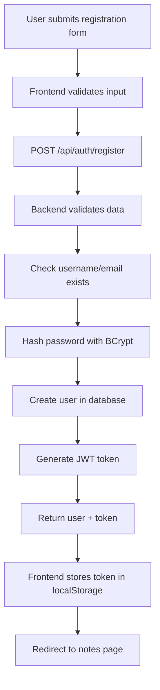
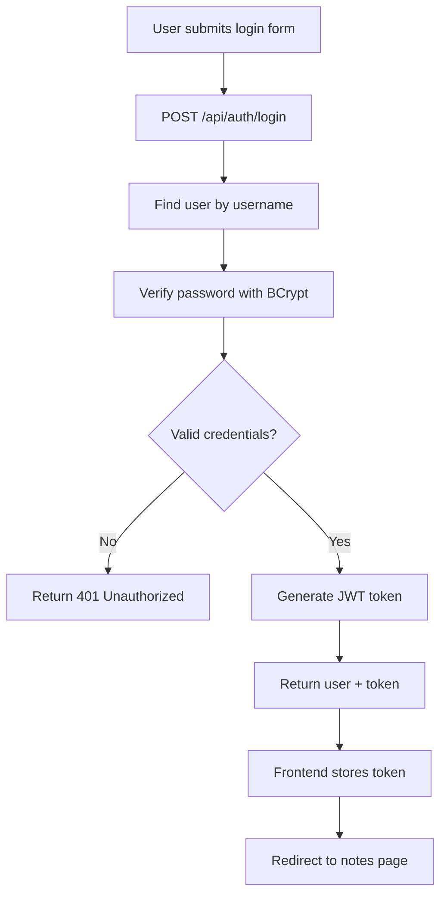
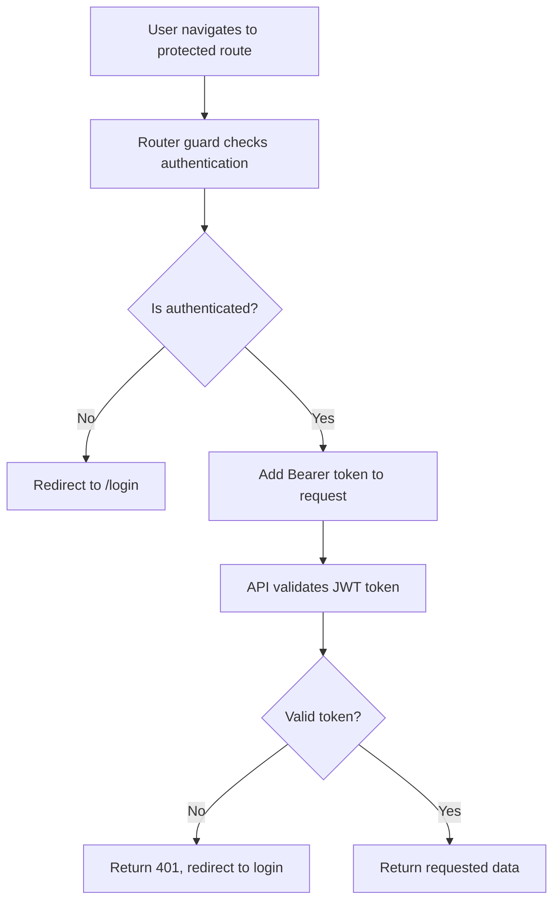

# NotesApp - Complete Technical Documentation

## 📋 Table of Contents

1. [Project Overview](#-project-overview)
2. [Backend Architecture](#-backend-architecture)
3. [Frontend Architecture](#-frontend-architecture)
4. [Database Design](#-database-design)
5. [API Design & Integration](#-api-design--integration)
6. [Authentication System](#-authentication-system)
7. [State Management](#-state-management)
8. [Project Structure](#-project-structure)
9. [Development Setup](#-development-setup)
10. [Technology Choices Rationale](#-technology-choices-rationale)

---

## 🎯 Project Overview

**NotesApp** is a full-stack web application for creating, managing, and organizing personal notes. It demonstrates modern web development practices with a clean separation between frontend and backend, secure authentication, and a responsive user interface.

### **Key Features:**
- ✅ User registration and login with JWT authentication
- ✅ CRUD operations for notes (Create, Read, Update, Delete)
- ✅ Search and filtering capabilities
- ✅ Responsive design with modern UI/UX
- ✅ Real-time state management
- ✅ RESTful API design
- ✅ Database relationships and indexing
- ✅ Error handling and validation
- ✅ Type safety with TypeScript

---

## 🏗️ Backend Architecture

### **Technology Stack:**
- **Framework:** ASP.NET Core 8.0 (Web API)
- **Database:** SQLite (via Microsoft.Data.Sqlite)
- **ORM:** Dapper (Micro-ORM for performance)
- **Authentication:** JWT (JSON Web Tokens)
- **Password Hashing:** BCrypt.Net-Next
- **API Documentation:** Swagger/OpenAPI

### **Why ASP.NET Core?**
- **Cross-platform:** Runs on Windows, Linux, macOS
- **High performance:** Built on .NET runtime with excellent performance
- **Built-in security:** Comprehensive security features out-of-the-box
- **Mature ecosystem:** Vast libraries and tooling support
- **Enterprise-ready:** Used in production applications worldwide

### **Why SQLite?**
- **File-based database:** No server setup required, perfect for development
- **Zero configuration:** No database server installation needed
- **Cross-platform:** Works on any operating system
- **Lightweight:** Small footprint, fast startup
- **ACID compliant:** Full transactional support

### **Why Dapper (Instead of Entity Framework)?**
- **Performance:** Raw SQL execution, minimal overhead
- **Control:** Full control over SQL queries and optimization
- **Lightweight:** No complex mapping or change tracking
- **Flexibility:** Easy to write complex queries and stored procedures
- **Learning curve:** Simpler than full ORM for basic CRUD operations

### **Backend Architecture Patterns:**

#### **1. Repository Pattern**
```csharp
// Why Repository Pattern?
// - Separation of concerns: Business logic separate from data access
// - Testability: Easy to mock repositories for unit tests
// - Maintainability: Changes to data access don't affect business logic
// - Consistency: Standardized data access across the application

public interface INotesRepository
{
    Task<IEnumerable<Note>> GetAllAsync(int userId, string? search, string? sortBy, string? sortOrder, int? page, int? pageSize);
    Task<Note?> GetByIdAsync(int id, int userId);
    Task<Note> CreateAsync(Note note);
    Task<Note> UpdateAsync(Note note);
    Task DeleteAsync(int id, int userId);
    Task<int> GetTotalCountAsync(int userId, string? search);
}
```

#### **2. Service Layer Pattern**
```csharp
// Why Service Layer?
// - Business logic encapsulation: Complex operations in dedicated services
// - Authorization: User context and permission checks
// - Validation: Input validation and business rules
// - Error handling: Centralized exception handling

public class NotesService
{
    private readonly INotesRepository _notesRepository;
    private readonly IUserContext _userContext;

    public async Task<IEnumerable<Note>> GetAllAsync(string? search, string? sortBy, string? sortOrder, int? page, int? pageSize)
    {
        var userId = _userContext.GetUserId(); // Authorization check
        return await _notesRepository.GetAllAsync(userId, search, sortBy, sortOrder, page, pageSize);
    }
}
```

#### **3. Dependency Injection (DI)**
```csharp
// Why Dependency Injection?
// - Loose coupling: Components depend on abstractions, not concrete implementations
// - Testability: Easy to inject mock dependencies for testing
// - Maintainability: Easy to swap implementations
// - Lifetime management: DI container manages object lifetimes

builder.Services.AddScoped<INotesRepository, NotesRepository>();
builder.Services.AddScoped<NotesService>();
```

### **Authentication & Security:**

#### **JWT Authentication**
```csharp
// Why JWT?
// - Stateless: No server-side session storage needed
// - Scalable: Easy to scale across multiple servers
// - Secure: Cryptographically signed tokens
// - Standard: Industry-standard authentication method

var tokenDescriptor = new SecurityTokenDescriptor
{
    Subject = new ClaimsIdentity(new[]
    {
        new Claim(ClaimTypes.NameIdentifier, user.Id.ToString()),
        new Claim(ClaimTypes.Name, user.Username),
        new Claim(ClaimTypes.Email, user.Email)
    }),
    Expires = DateTime.UtcNow.AddMinutes(60), // 1-hour expiration
    SigningCredentials = new SigningCredentials(new SymmetricSecurityKey(key), SecurityAlgorithms.HmacSha256Signature)
};
```

#### **Password Security (BCrypt)**
```csharp
// Why BCrypt?
// - Slow hashing: Resistant to brute-force attacks
// - Salted: Unique salt for each password
// - Adaptive: Work factor can be increased over time
// - Proven: Industry-standard password hashing

var hashedPassword = BCrypt.Net.BCrypt.HashPassword(password);
var isValid = BCrypt.Net.BCrypt.Verify(password, hashedPassword);
```

### **Middleware & Error Handling:**
```csharp
// Why Custom Middleware?
// - Centralized error handling: Consistent error responses
// - Logging: Centralized request/response logging
// - Security: Request validation and sanitization
// - Performance: Request timing and monitoring

app.UseExceptionHandling(); // Custom exception handling middleware
app.UseAuthentication();   // JWT authentication middleware
app.UseAuthorization();    // Authorization middleware
```

---

## 🎨 Frontend Architecture

### **Technology Stack:**
- **Framework:** Vue 3 (Composition API)
- **Language:** TypeScript
- **State Management:** Pinia
- **Routing:** Vue Router 4
- **HTTP Client:** Axios
- **Styling:** Tailwind CSS
- **Build Tool:** Vite
- **Development:** Hot Module Replacement (HMR)

### **Why Vue 3?**
- **Composition API:** Better code organization and reusability
- **Performance:** Smaller bundle size, faster rendering
- **TypeScript support:** Excellent TypeScript integration
- **Ecosystem:** Rich ecosystem of libraries and tools
- **Learning curve:** Easier to learn than React for beginners

### **Why TypeScript?**
- **Type safety:** Catch errors at compile time
- **Better IDE support:** Auto-completion, refactoring, navigation
- **Self-documenting:** Types serve as documentation
- **Scalability:** Easier to maintain large codebases
- **JavaScript compatibility:** Can use existing JavaScript libraries

### **Why Pinia (State Management)?**
- **TypeScript support:** First-class TypeScript integration
- **Lightweight:** Smaller bundle size than Vuex
- **Composition API:** Works seamlessly with Vue 3 Composition API
- **DevTools:** Excellent browser devtools integration
- **Simple:** Easier to learn and use than Vuex

### **Frontend Architecture Patterns:**

#### **1. API Layer (Separation of Concerns)**
```typescript
// Why API Layer?
// - Single responsibility: HTTP client handles all network requests
// - Reusability: API methods can be used across multiple components
// - Error handling: Centralized error handling and transformation
// - Type safety: Typed request/response objects

export class AuthApi {
  static async login(credentials: LoginRequest): Promise<AuthResponse> {
    const response = await httpClient.post<AuthResponse>('/auth/login', credentials)
    return response.data
  }
}
```

#### **2. State Management (Pinia Stores)**
```typescript
// Why Pinia Stores?
// - Centralized state: All app state in one place
// - Reactive: Automatic UI updates when state changes
// - Persistence: Local storage integration for auth tokens
// - Actions: Asynchronous operations (API calls)

export const useAuthStore = defineStore('auth', () => {
  const user = ref<User | null>(null)
  const token = ref<string | null>(localStorage.getItem('auth_token'))
  const loading = ref(false)
  const error = ref<string | null>(null)

  const isAuthenticated = computed(() => !!token.value) // Reactive computed property
})
```

#### **3. Composition API Components**
```typescript
// Why Composition API?
// - Logic reusability: Extract and reuse logic across components
// - Better organization: Related logic grouped together
// - TypeScript integration: Better type inference
// - Performance: No unnecessary reactivity

<script setup lang="ts">
import { ref, reactive, onMounted } from 'vue'
import { useNotesStore } from '@/stores/notes'

// Composables - reusable logic
const notesStore = useNotesStore()
const { notes, loading, error, fetchNotes } = notesStore

// Reactive state
const searchQuery = ref('')
const sortBy = ref<'title' | 'createdAt' | 'updatedAt'>('createdAt')

// Lifecycle hooks
onMounted(() => {
  fetchNotes() // Load data when component mounts
})
</script>
```

### **HTTP Client & Error Handling:**
```typescript
// Why Custom HTTP Client?
// - Request interceptors: Automatic token attachment
// - Response interceptors: Automatic error handling
// - Type transformation: Backend format to frontend format
// - Retry logic: Handle network failures gracefully

class HttpClient {
  private setupInterceptors() {
    // Request interceptor - add auth token
    this.instance.interceptors.request.use((config) => {
      const token = localStorage.getItem('auth_token')
      if (token) {
        config.headers.Authorization = `Bearer ${token}`
      }
      return config
    })

    // Response interceptor - handle auth errors
    this.instance.interceptors.response.use(
      (response) => response,
      (error) => {
        if (error.response?.status === 401) {
          localStorage.removeItem('auth_token')
          window.location.href = '/login' // Redirect to login
        }
        return Promise.reject(error)
      }
    )
  }
}
```

### **Routing & Navigation:**
```typescript
// Why Vue Router?
// - Client-side routing: Fast navigation without page reloads
// - Nested routes: Organize complex route structures
// - Route guards: Protect routes based on authentication
// - History management: Browser back/forward buttons work

router.beforeEach((to, from, next) => {
  const authStore = useAuthStore()

  if (to.meta.requiresAuth && !authStore.isAuthenticated) {
    next('/login') // Redirect unauthenticated users
  } else if (to.path === '/login' && authStore.isAuthenticated) {
    next('/notes') // Redirect authenticated users away from login
  } else {
    next() // Continue navigation
  }
})
```

---

## 🗄️ Database Design

### **Schema Design:**

#### **Users Table**
```sql
CREATE TABLE Users (
    Id INTEGER PRIMARY KEY AUTOINCREMENT,
    Username TEXT NOT NULL UNIQUE,
    Email TEXT NOT NULL UNIQUE,
    PasswordHash TEXT NOT NULL,
    CreatedAt TEXT NOT NULL DEFAULT (datetime('now'))
);
```

#### **Notes Table**
```sql
CREATE TABLE Notes (
    Id INTEGER PRIMARY KEY AUTOINCREMENT,
    Title TEXT NOT NULL,
    Content TEXT,
    CreatedAt TEXT NOT NULL DEFAULT (datetime('now')),
    UpdatedAt TEXT NOT NULL DEFAULT (datetime('now')),
    UserId INTEGER NOT NULL,
    FOREIGN KEY (UserId) REFERENCES Users(Id) ON DELETE CASCADE
);
```

### **Why This Design?**

#### **1. User-Notes Relationship**
- **One-to-Many:** One user can have many notes
- **Foreign Key:** `UserId` references `Users(Id)`
- **Cascade Delete:** When user is deleted, all notes are deleted
- **Data Integrity:** Ensures notes always belong to valid users

#### **2. Indexing Strategy**
```sql
CREATE INDEX IX_Notes_UserId ON Notes(UserId);        -- Fast user-specific queries
CREATE INDEX IX_Notes_CreatedAt ON Notes(CreatedAt DESC); -- Fast sorting by date
CREATE INDEX IX_Notes_UpdatedAt ON Notes(UpdatedAt DESC); -- Fast sorting by update time
CREATE INDEX IX_Users_Username ON Users(Username);     -- Fast login queries
CREATE INDEX IX_Users_Email ON Users(Email);           -- Fast email lookups
```

#### **3. Data Types**
- **INTEGER PRIMARY KEY AUTOINCREMENT:** SQLite auto-incrementing IDs
- **TEXT:** Variable-length strings (SQLite doesn't have separate VARCHAR)
- **DATETIME:** Stored as ISO 8601 strings for compatibility
- **UNIQUE constraints:** Prevent duplicate usernames/emails

### **Why SQLite for Development?**
- **No setup required:** File-based database, no server needed
- **Cross-platform:** Works on Windows, macOS, Linux
- **ACID compliance:** Full transactional support
- **SQL standard:** Most SQL features supported
- **Migration ready:** Easy to switch to PostgreSQL/MySQL for production

---

## 🔗 API Design & Integration

### **RESTful API Design:**

#### **Authentication Endpoints**
```http
POST /api/auth/register  - Create new user account
POST /api/auth/login     - Authenticate user
GET  /api/auth/me        - Get current user info
```

#### **Notes CRUD Endpoints**
```http
GET    /api/notes        - List user's notes (with search, sort, pagination)
GET    /api/notes/{id}   - Get specific note
POST   /api/notes        - Create new note
PUT    /api/notes/{id}   - Update existing note
DELETE /api/notes/{id}   - Delete note
```

### **API Response Format:**
```typescript
// Backend Response Format
interface BackendApiResponse<T> {
  Data: T;           // Actual data
  Message?: string;  // Optional message
  Success: boolean;  // Success status
}

// Frontend Transformed Format
interface ApiResponse<T> {
  data: T;           // Actual data (flattened)
  message?: string;  // Optional message
  success: boolean;  // Success status
}
```

### **Why This API Design?**

#### **1. Consistent Response Format**
- **Predictable:** All responses follow same structure
- **Error handling:** Consistent error response format
- **Success indication:** Clear success/failure status
- **Messages:** Human-readable status messages

#### **2. HTTP Status Codes**
- **200 OK:** Successful GET/PUT requests
- **201 Created:** Successful POST requests
- **204 No Content:** Successful DELETE requests
- **400 Bad Request:** Invalid request data
- **401 Unauthorized:** Authentication required
- **404 Not Found:** Resource doesn't exist
- **500 Internal Server Error:** Server-side errors

#### **3. Query Parameters (Notes API)**
```http
GET /api/notes?search=meeting&sortBy=createdAt&sortOrder=desc&page=1&pageSize=10
```
- **Search:** Full-text search across title and content
- **Sorting:** Sortable fields: title, createdAt, updatedAt
- **Pagination:** Page-based pagination with configurable page size
- **Filtering:** User-specific filtering (no other user data exposed)

### **Frontend-Backend Communication:**

#### **1. Proxy Configuration (Vite)**
```typescript
// vite.config.ts
export default defineConfig({
  server: {
    proxy: {
      '/api': {
        target: 'http://localhost:5000',  // Backend URL
        changeOrigin: true,               // Handle CORS
        secure: true,                     // HTTPS support
      }
    }
  }
})
```

#### **2. HTTP Client with Interceptors**
```typescript
// Request Interceptor: Add auth token
axios.interceptors.request.use((config) => {
  const token = localStorage.getItem('auth_token')
  if (token) {
    config.headers.Authorization = `Bearer ${token}`
  }
  return config
})

// Response Interceptor: Handle auth errors
axios.interceptors.response.use(
  (response) => response,
  (error) => {
    if (error.response?.status === 401) {
      localStorage.removeItem('auth_token')
      window.location.href = '/login'
    }
    return Promise.reject(error)
  }
)
```

---

## 🔐 Authentication System

### **Authentication Flow:**

#### **1. Registration Process**


#### **2. Login Process**


#### **3. Protected Route Access**


### **Security Measures:**

#### **1. Password Security**
- **BCrypt hashing:** Slow, salted password hashing
- **Unique salts:** Each password gets unique salt
- **Work factor:** Configurable computational cost

#### **2. JWT Security**
- **Short expiration:** Tokens expire in 60 minutes
- **Secure signing:** HMAC-SHA256 signature
- **HTTPS only:** Tokens only sent over secure connections
- **Automatic cleanup:** Expired tokens become invalid

#### **3. API Security**
- **CORS protection:** Only frontend domain can access API
- **Input validation:** Server-side validation of all inputs
- **SQL injection prevention:** Parameterized queries with Dapper
- **Authentication required:** All notes endpoints require auth

---

## 🗂️ State Management

### **Pinia Store Architecture:**

#### **1. Auth Store**
```typescript
// Why separate stores?
// - Single responsibility: Each store handles one domain
// - Performance: Only relevant state updates trigger re-renders
// - Organization: Clear separation of concerns
// - Testing: Easy to test individual stores

export const useAuthStore = defineStore('auth', () => {
  // State
  const user = ref<User | null>(null)
  const token = ref<string | null>(localStorage.getItem('auth_token'))
  const loading = ref(false)
  const error = ref<string | null>(null)

  // Getters (computed properties)
  const isAuthenticated = computed(() => !!token.value)

  // Actions (functions)
  async function login(credentials: LoginRequest) {
    loading.value = true
    error.value = null

    try {
      const response = await AuthApi.login(credentials)
      token.value = response.token
      user.value = response.user
      localStorage.setItem('auth_token', response.token)
      return response
    } catch (err: any) {
      error.value = err.message
      throw err
    } finally {
      loading.value = false
    }
  }

  function logout() {
    token.value = null
    user.value = null
    localStorage.removeItem('auth_token')
  }

  return {
    user, token, loading, error, isAuthenticated,
    login, register, loadCurrentUser, logout
  }
})
```

#### **2. Notes Store**
```typescript
export const useNotesStore = defineStore('notes', () => {
  // State
  const notes = ref<Note[]>([])
  const currentNote = ref<Note | null>(null)
  const loading = ref(false)
  const error = ref<string | null>(null)
  const filters = ref<NoteFilters>({
    page: 1,
    pageSize: 10,
    sortBy: 'createdAt',
    sortOrder: 'desc',
  })
  const totalCount = ref(0)

  // Getters
  const filteredNotes = computed(() => {
    if (!filters.value.search) return sortedNotes.value
    const searchTerm = filters.value.search.toLowerCase()
    return sortedNotes.value.filter(note =>
      note.title.toLowerCase().includes(searchTerm) ||
      (note.content && note.content.toLowerCase().includes(searchTerm))
    )
  })

  // Actions
  async function fetchNotes() {
    loading.value = true
    error.value = null

    try {
      const response = await NotesApi.getNotes(filters.value)
      notes.value = response.notes
      totalCount.value = response.totalCount
    } catch (err: any) {
      error.value = err.message
    } finally {
      loading.value = false
    }
  }

  return {
    notes, currentNote, loading, error, filters, totalCount, filteredNotes,
    fetchNotes, createNote, updateNote, deleteNote, setFilters
  }
})
```

### **Why Pinia Instead of Vuex?**

#### **1. Composition API Integration**
- **Native support:** Designed for Vue 3 Composition API
- **TypeScript:** First-class TypeScript support
- **Smaller size:** 1.5KB vs Vuex 4KB
- **Simpler:** Less boilerplate code

#### **2. Better Developer Experience**
- **DevTools:** Excellent browser devtools integration
- **Type inference:** Better TypeScript support
- **Hot reload:** Better hot module replacement
- **Actions:** Simplified async action handling

---

## 📁 Project Structure

### **Backend Structure:**
```
backend/
├── NotesApi/
│   ├── Controllers/          # API endpoints
│   │   ├── AuthController.cs # Authentication endpoints
│   │   └── NotesController.cs # Notes CRUD endpoints
│   ├── Models/              # Data models and DTOs
│   │   ├── User.cs          # User entity
│   │   ├── Note.cs          # Note entity
│   │   └── Auth.cs          # Auth-related DTOs
│   ├── Services/            # Business logic
│   │   ├── AuthService.cs   # Authentication logic
│   │   ├── NotesService.cs  # Notes business logic
│   │   └── UserContext.cs   # Current user context
│   ├── Repositories/        # Data access layer
│   │   ├── INotesRepository.cs # Notes repository interface
│   │   ├── IUsersRepository.cs # Users repository interface
│   │   ├── NotesRepository.cs  # Notes repository implementation
│   │   └── UsersRepository.cs  # Users repository implementation
│   ├── Data/                # Database setup and connection
│   │   ├── DatabaseInitializer.cs # Database schema creation
│   │   └── DatabaseConnectionFactory.cs # Connection factory
│   └── Extensions/          # Service configuration
│       └── ServiceExtensions.cs # DI and service registration
├── database-setup.sql       # Initial database schema (SQL Server version)
└── README.md               # Project documentation
```

### **Frontend Structure:**
```
frontend/
├── src/
│   ├── api/                 # API communication layer
│   │   ├── auth.ts          # Authentication API calls
│   │   ├── notes.ts         # Notes API calls
│   │   └── http.ts          # HTTP client with interceptors
│   ├── stores/              # State management (Pinia)
│   │   ├── auth.ts          # Authentication state
│   │   └── notes.ts         # Notes state and actions
│   ├── views/               # Route components
│   │   ├── LoginView.vue    # Login page
│   │   ├── RegisterView.vue # Registration page
│   │   ├── NotesListView.vue # Notes listing page
│   │   ├── NoteCreateView.vue # Create note page
│   │   └── NoteDetailView.vue # Note detail/edit page
│   ├── components/          # Reusable components
│   │   ├── NavBar.vue       # Navigation bar
│   │   └── LoadingSpinner.vue # Loading indicator
│   ├── types/               # TypeScript type definitions
│   │   ├── api.ts           # API response types
│   │   ├── note.ts          # Note-related types
│   │   └── user.ts          # User-related types
│   ├── router/              # Vue Router configuration
│   │   └── index.ts         # Routes and navigation guards
│   ├── assets/              # Static assets
│   └── App.vue             # Root component
├── vite.config.ts          # Vite build configuration
├── tailwind.config.js      # Tailwind CSS configuration
└── tsconfig.json           # TypeScript configuration
```

### **Why This Structure?**

#### **1. Backend Organization**
- **Feature-based:** Related files grouped by feature (Auth, Notes)
- **Layered architecture:** Clear separation of concerns
- **SOLID principles:** Each class has single responsibility
- **Dependency injection:** Loose coupling between components

#### **2. Frontend Organization**
- **Feature-based:** API, stores, and views grouped logically
- **Reusable components:** Common UI elements in separate files
- **Type safety:** Centralized type definitions
- **Asset management:** Static files organized by type

---

## 🔧 Development Setup

### **Prerequisites:**
- **Node.js 18+:** For frontend development
- **.NET 8 SDK:** For backend development
- **Git:** Version control
- **Modern browser:** For frontend testing

### **Installation:**

#### **1. Backend Setup**
```bash
cd backend/NotesApi
dotnet restore          # Restore NuGet packages
dotnet build           # Build the project
dotnet run             # Start development server
```

#### **2. Frontend Setup**
```bash
cd frontend
npm install            # Install dependencies
npm run dev           # Start development server with HMR
```

### **Database Initialization:**
- **Automatic:** SQLite database creates automatically on first run
- **Schema:** Tables and indexes created by `DatabaseInitializer`
- **Data:** No initial data seeded (users create their own accounts)

### **Development Workflow:**
```bash
# Terminal 1 - Backend
cd backend/NotesApi && dotnet run

# Terminal 2 - Frontend
cd frontend && npm run dev

# Access application at http://localhost:3000
# Backend API at http://localhost:5000
# API documentation at http://localhost:5000/swagger
```

---

## 🤔 Technology Choices Rationale

### **Why This Tech Stack?**

#### **1. Backend: ASP.NET Core + Dapper + SQLite**
- **ASP.NET Core:** Enterprise-ready, high-performance, secure
- **Dapper:** Fast, lightweight, full SQL control
- **SQLite:** Zero-config, file-based, perfect for development

#### **2. Frontend: Vue 3 + TypeScript + Pinia**
- **Vue 3:** Modern, performant, excellent developer experience
- **TypeScript:** Type safety, better development experience
- **Pinia:** Lightweight, TypeScript-native state management

#### **3. Full-Stack Integration**
- **RESTful API:** Standard, scalable, well-documented
- **JWT Authentication:** Stateless, secure, industry-standard
- **Responsive Design:** Mobile-first, accessible, modern UI

### **Alternative Considerations:**

#### **Why Not Entity Framework?**
- **Complexity:** EF adds complexity for simple CRUD operations
- **Performance:** Dapper is faster for basic operations
- **Control:** Full SQL control with Dapper
- **Size:** Smaller application footprint

#### **Why Not React?**
- **Learning curve:** Vue is easier for beginners
- **Bundle size:** Vue has smaller default bundle
- **Composition API:** Better code organization than React hooks
- **Ecosystem:** Rich, mature ecosystem

#### **Why Not PostgreSQL/MySQL?**
- **Setup complexity:** SQLite requires no setup
- **Development speed:** Faster development iteration
- **Resource usage:** Lower memory and disk usage
- **Migration ready:** Easy to switch to production database

### **Production Considerations:**

#### **For Production Deployment:**
1. **Database:** Switch to PostgreSQL or SQL Server
2. **Authentication:** Implement refresh tokens
3. **Caching:** Add Redis for session and data caching
4. **Monitoring:** Add logging and monitoring tools
5. **Security:** Implement rate limiting and DDoS protection
6. **Backup:** Implement automated database backups

#### **Scaling Considerations:**
1. **Load balancing:** Multiple backend instances
2. **Database scaling:** Read replicas, connection pooling
3. **CDN:** Static asset delivery
4. **Caching strategy:** API response caching

---

## 🎯 Key Learning Objectives

This project demonstrates:

### **Backend Development:**
- ✅ Modern ASP.NET Core API development
- ✅ Clean Architecture with Repository and Service patterns
- ✅ JWT authentication with secure password hashing
- ✅ Database design and optimization
- ✅ Dependency injection and IoC containers
- ✅ Error handling and middleware

### **Frontend Development:**
- ✅ Vue 3 Composition API
- ✅ TypeScript for type safety
- ✅ State management with Pinia
- ✅ Component-based architecture
- ✅ Responsive design with Tailwind CSS
- ✅ Modern development tools (Vite, HMR)

### **Full-Stack Integration:**
- ✅ RESTful API design
- ✅ Frontend-backend communication
- ✅ Authentication flow implementation
- ✅ Error handling across the stack
- ✅ Development and production considerations

---

## 🚀 Getting Started

### **Quick Start:**
1. **Clone repository**
2. **Backend:** `cd backend/NotesApi && dotnet run`
3. **Frontend:** `cd frontend && npm run dev`
4. **Open:** `http://localhost:3000`

### **Next Steps:**
- Create user account
- Login to the application
- Create your first note
- Explore search and filtering
- Test all CRUD operations

---

**This NotesApp demonstrates modern full-stack web development practices with clean architecture, type safety, and excellent developer experience. It's production-ready for small to medium applications and serves as an excellent foundation for learning full-stack development!** 🎉
